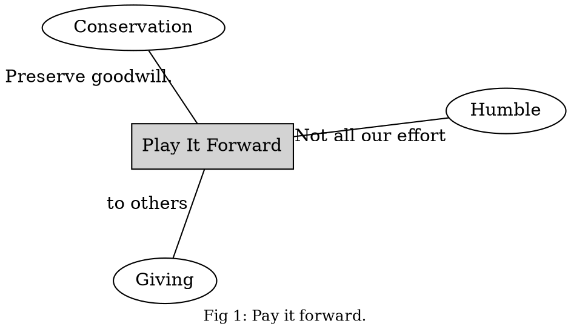
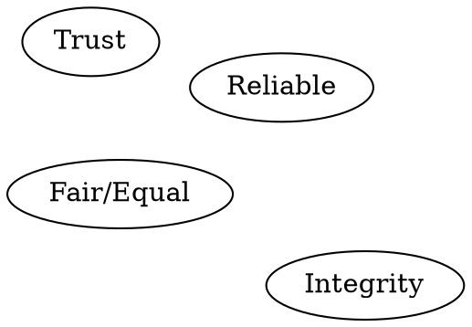

# How I think I should live

## Value based living

### Common life sayings with values built-in

* Honesty
  * Doing what you said you're going to do?

  * Finishing what you start.
    * Taking responsibility for your actions.
    * Cleaning up a mess that you make.
      * Leaving something better than what you found it (just a little)
    * Not lying.
    * Keeping promises
* Willing to do the work.  Not lazy.
  * Life long love of learning.  
* Compassionate and kind to others.
  * Considerate and forgiving.
* Working smarter and not harder.
* Looking for a way to help others.
* Servant leadership.
  * Power is loaned to the leader and not a right.
* Nothing in life is guaranteed.
  * Life isn't inherantly fair, but we try to be fair to others as best we can.
  * Treat others the way you want to be treated.
* Don't cause another person or animal unnecessary pain.
* Stand up for what you think is right especially for the sake of others.
* Provide for your loved ones as best you can, doing your best.
* Large amounts of effort take time.  Be patient with the progress.
* Trust but verify, don't be a fool.
  * Fool me once, shame on you, fool me twice shame on me.
* Hope for the best and plan for the rest.
* Acknowledge that all humans are sinners.  Nobody's perfect including ourselves.
* We can see the faults of others better than our own, so beware hipocracy.
* Prioritized requirements such that some shalls trump others.
* Pay it forward

#### Pay It Forward

We work hard to give others whom we might never know the same or better
advantages of our own good fortune.  We admit that while we strive virilantly
for our aims, that some element of chance and environment come into play.  For
the times where things go well, we thank providence and seek to do homage to
providence by maintaining the same fertility of opportunies for others the will
be rewarded in some same way.

#### Dunno

Seeks not to confuse or distort as it's a form of lying.

Is Giving a form of power?

#### Humble

We believe in equality.  Each person is entitled to most of the same
kinds of basic civil liberties as the next person.  They deserve some
degree of respect and deserve to be considered fair and honest until 
personal experience proves otherwise.

As we exceed in our abilities and amass more and more "power" or
"control" over our surroundings, we are comforted and grow somewhat
lax and contented.  We look with pity upon those that don't have our
comfort or our power.  Our power might come from knowledge that was
mostly handed to us, but that we might have striven for via study at
a school.  Because we passed examinations of this suckled knowlege, we
feel emboldened and elevated from the states of those that might not
have chosen to attain this knowledge. Because we are in such command
of knowledge and perhaps think that we understand things more than
another or perhaps we feel that we've worked harder or are somehow more
deserving than others.  This leads us to a sense of eliteness and
entitlement.  We have papers that prove how good we are and medals and
accolades from others that resound our good deeds and our heroic efforts.
Others that don't have these things are lesser than us.  They don't deserve
the things that we deserve.  These are the thoughts.  However, this is not
really the case. When opportunities are limited and resources are slim, the
question of best fit comes into play.  Then, it should be via competition
perhaps that the dispatch of the opportunity should be decided.
